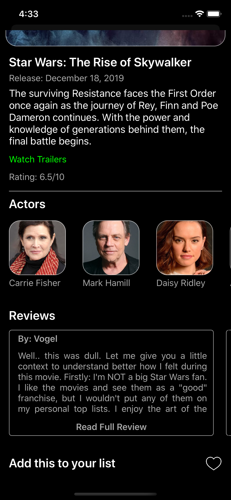

# HotelRental

Simple iOS application for Hotel Movie Rental Services. Built using Swift, Google Firebase and the MovieDB API. Wrote with Xcode 11.1 & Swift 5 

    
     
    

## Completed Features 

1. User **sign in & registration*** using Firebase Auth.
1. Showing of newly released, top rated, popular and upcoming movies. 
1. Ability to **search** for any movie. 
1. Displaying basic **movie info** such as poster, plot outline, release date, rating and more. 
1. Sections to show recent **reviews** and full list of **cast members** including images. 
1. List of available **trailers** plus the ability to view from inside the app.
1. Ability to add specific movies to a **list** for easier access. 

## Sample Screens 

    
    
    
    
    

## Running Source Code  

1. Make sure Xcode 11.x is installed in your machine 
1. Install cocoapods from [here.](https://cocoapods.org/)
1. Clone the repository 
1. Run `pod install` on main directory
1. Open xcworkspace file 
1. Build and run from Xcode on simulator

